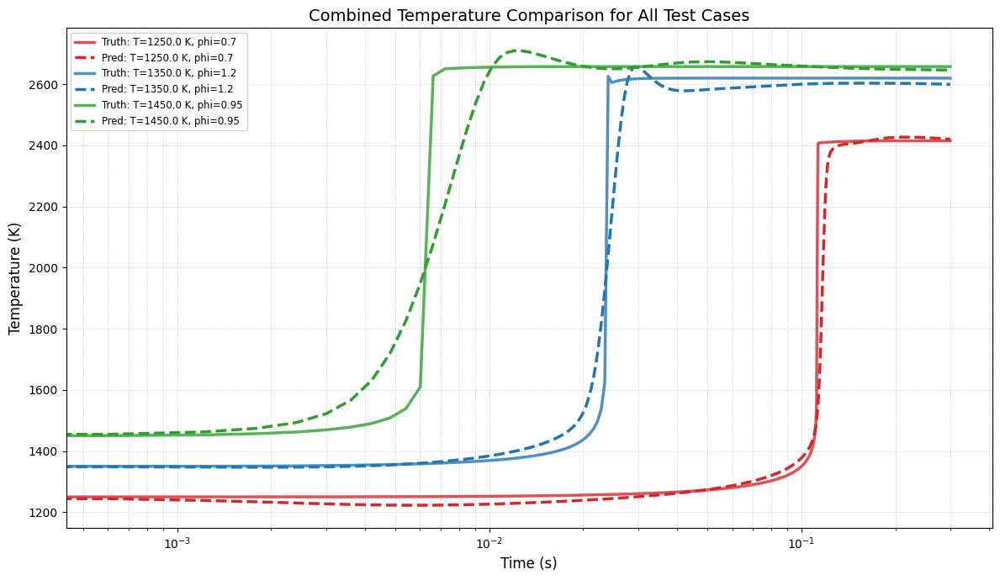
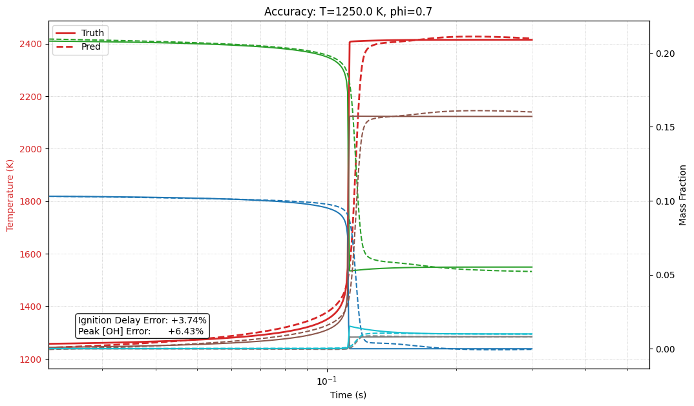

# ChemNODE-Ammonia: Fast Surrogate Modeling for Stiff Combustion Kinetics


**Author:** Aditya Prasad  
**Institution:** IIT Gandhinagar  
**Course:** ME 691: Scientific Machine Learning for Thermo-fluids

---

## 📌 Project Overview
Simulating ammonia ($NH_3$) combustion is critical for designing carbon-free energy systems but is computationally expensive due to the extreme **numerical stiffness** of detailed chemical mechanisms. The reaction timescales vary from nanoseconds to milliseconds, forcing traditional solvers to take tiny steps.

This project implements a **Neural Ordinary Differential Equation (Neural ODE)** framework to create a high-fidelity surrogate model for the **Stagni et al. (2023)** ammonia mechanism (31 species).

The surrogate learns the continuous-time chemical dynamics ($d\mathbf{y}/dt$) and integrates them using a **JIT-compiled explicit solver**, achieving an **~85x speed-up** over traditional stiff solvers (CVODE/BDF) while maintaining <3% error in ignition delay predictions.

---

## ⚙️ Key Technical Highlights

### 1. Physics-Informed Architecture
Instead of mapping inputs directly to outputs (which ignores the path), we model the **governing differential equation**:
$$\frac{d\mathbf{y}}{dt} = \mathcal{N}(\mathbf{y}, t; \theta)$$
where $\mathcal{N}$ is a deep neural network parametrized by $\theta$. This ensures the model respects the integral nature of the physical system.

### 2. Stiffness Reduction
* **Original System:** Highly stiff; requires implicit solvers (BDF/LSODA) with expensive Jacobian inversions.
* **Surrogate System:** Trained using an explicit solver in the loop. The network learns a **non-stiff representation** of the dynamics, allowing the use of fast explicit solvers (RK4) during inference.

### 3. Robust Data Handling
Following the methodology of *Bansude et al.*, we employ:
* **Global Min-Max Normalization:** Scales all 31 species + Temperature to $[0, 1]$ to stabilize gradients.
* **Log-Space Temporal Sampling:** Captures fast ignition transients and slow equilibrium approaches equally well.

### 4. High-Performance Inference
* **JIT Compilation:** The trained PyTorch model and the custom RK4 solver are compiled using `torch.jit.script` to fuse kernels and remove Python overhead.
* **Batching:** Inference is optimized for massive parallelism on GPUs.

---

## 📊 Key Results

### 1. Qualitative Accuracy
The model accurately captures the ignition delay and species evolution for unseen test cases (e.g., varying $T_0$ and $\phi$).

| Temperature Profile | Species Evolution |
|:---:|:---:|
|  |  |
*(Comparisons of Ground Truth Cantera (Solid) vs. ChemNODE Prediction (Dashed))*

### 2. Quantitative Metrics
Evaluated on unseen test data using the $dT/dt_{max}$ definition for ignition delay:

| Metric | Error Margin |
| :--- | :--- |
| **Ignition Delay Time** | $\pm 2.5\%$ |
| **Equilibrium Temp** | $< 0.5\%$ |
| **Peak [OH] Radical** | $< 15\%$ |

### 3. Computational Performance
Benchmarked on a batch of 2000 simulations:

| Solver | Hardware | Avg. Time (ms) | Speed-up |
| :--- | :---: | :---: | :---: |
| **Cantera (Stiff BDF)** | CPU | 300.0 | 1.0x |
| **ChemNODE (JIT RK4)** | GPU (T4) | 3.5 | **~85.7x** |

---

## 📂 Repository Structure

```text
├── data/
|   ├── training_data.npz
│   ├── ammonia_mech.yaml       # Stagni et al. (2023) Mechanism
│   └── normalization_params.json
├── models/
│   └── chem_node_net_3lay_128dim.pth    # Trained PyTorch Weights
├── notebooks/
│   ├── 1_Data_Generation.ipynb # Cantera 0D reactor simulations
│   ├── 2_Preprocessing.ipynb   # Normalization & Interpolation
│   ├── 3_Model_Training.ipynb  # Neural ODE Training loop
│   └── 4_Evaluation.ipynb      # Accuracy & Speed benchmarking
├── requirements.txt
└── README.md
